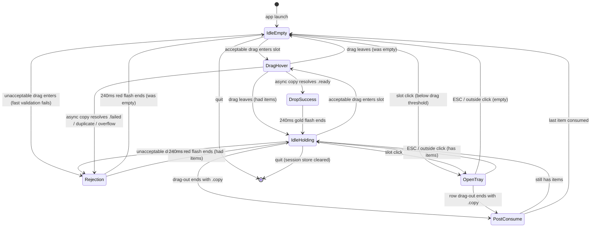

# Pixel Shelf Pivot

## Overview

ShotNDrop stops watching folders. It becomes a **movable pixel-styled drop shelf** that sits on the user's screen and only receives screenshots the user drags into it. Everything captured but *not* dragged in follows macOS's own default save behavior (Desktop or wherever the user configured); ShotNDrop never sees it.

Visual language is committed dark-pixel, themed after the Solo Leveling "System" quest panel — deep navy ground, cyan corner brackets, violet/gold accents, bitmap fonts, stepped motion. See the accepted design artifact linked in frontmatter for the visual spec.

The previous plan (`260823-1738-floating-screenshot-shelf-ux`) implemented an auto-ingest state-machine shelf that was rejected in design review. Its 86-passing test suite is a reference; its code direction is not carried forward. The user chose Revert-and-re-plan.

## Scope Contract

### In scope

- A single always-visible, movable, non-focus-stealing `NSPanel` that renders as a 96 × 96 pt pixel "slot" and remembers its position within the running session. Collection behavior includes `fullScreenAuxiliary` so the shelf overlays fullscreen apps (Yoink-diverging, CleanShot-like).
- Activation policy: **accessory app** (`LSUIElement = true` in Info.plist). No Dock icon, no Cmd-Tab entry. Menu-bar icon + shelf panel are the only surfaces.
- No global keyboard shortcut. Tray triggers are: click the shelf, click the menu-bar icon.
- Menu-bar icon retained from the current scaffold as an escape hatch when the shelf is off-screen. Its menu holds exactly three items: `CLEAR`, `CHECK FOR UPDATES`, `QUIT`. The update action checks the GitHub latest-release API and, when a newer version exists, offers to open its release page. Clicking the icon toggles the tray.
- Seven slot states: `idle-empty`, `idle-holding`, `drag-hover`, `open-tray`, `drop-success` (240 ms gold flash), `rejection` (240 ms red flash — overflow, duplicate, validation-fail, copy-fail), `post-consume`.
- Wake-on-drag activation only when a drag session enters the slot's dragging area **and** a fast metadata-only `canAccept` check passes — brackets extend, glow intensifies, `DROP ITEM` prompt surfaces. Unacceptable drags return `NSDragOperation.none` immediately without entering `drag-hover`.
- Panel click-vs-drag disambiguation: 4 pt movement threshold from mouse-down. Below threshold → click (opens tray). At or above → drag (repositions panel).
- Drop-in acceptance from macOS's floating screenshot thumbnail, from Finder, and from any file URL of a supported image type. Supported UTIs: PNG, JPEG, HEIC, TIFF, WebP, and **GIF (animation preserved — bytes are copied intact; the peek renders the first frame statically, the drag-out payload carries the multi-frame GIF unchanged)**. `performDragOperation` is **two-phase**: (1) synchronously snapshot the bytes from the drag pasteboard before returning (macOS may delete the temp source URL immediately after), reserve a `.pending` inventory slot; (2) off-main dispatch writes the snapshot to the session store, computes duplicate fingerprint, then main-actor resolves the slot to `.ready` (triggering drop-success gold flash) or `.failed` (triggering rejection red flash).
- Duplicate detection during phase 2 of the drop uses fingerprint `(byte-count, first-4KB-SHA256, last-4KB-SHA256)`. Match against every held item; on match, resolve as `.failed` with reason `duplicate`.
- Click-to-open tray: vertical hunter-inventory rows (rank stripe, pixel-framed thumbnail, filename + stats, drag-handle rune), ESC collapses. Tray-open direction resolves one of four anchors — `below-leading`, `below-trailing`, `above-leading`, `above-trailing` — whichever keeps the tray inside `NSScreen.visibleFrame`.
- Tray max height caps at 60 % of the selected display's `visibleFrame.height` (approx. 12 rows on a 1400 pt display). When inventory exceeds that height, the tray becomes vertically scrollable inside its own bounds; the pixel chrome (header, footer, corner brackets) does not scroll.
- Drag-out from a tray row **consumes** the item after the OS reports `.copy` from `draggingSession(_:endedAt:operation:)`. The source advertises **only `.copy`** — never `.move` or `.link` — to prevent double-delete semantics on move-preferring destinations.
- Right-click on the slot: `NSMenu` with `CLEAR` (gated on non-empty inventory), `CHECK FOR UPDATES`, and `QUIT`. No automatic or background update checks. Right-clicking while the tray is open first collapses the tray, then presents the menu.
- Solo Leveling pixel design system: Press Start 2P / VT323 / Silkscreen fonts (bundled), palette tokens, stepped motion utilities, reduced-motion accommodation observed at runtime (not just launch).
- Session-only lifetime: quit clears everything on disk (session store). No 24-hour expiry, no persistent history.
- Session store directories use per-launch UUID naming (`ShotNDropSession-<UUIDv4>/`) with a `flock`-held lock file inside. Launch-time sweep removes directories whose lock file is unheld — the OS releases `flock` on process death (clean exit or crash), giving free crash-recovery.
- Rejection UX: red flash for 240 ms + Silkscreen label (`— SHELF FULL —`, `— DUPLICATE —`, `— UNAVAILABLE —`) + **stepped-shake** of the entire slot (4 steps × 60 ms, ±3 pt horizontal offset). Shake is disabled under Reduce Motion; label and flash remain.
- Media abstraction (`ShelfMediaKind`) accepts image types now; `.video` case exists but is rejected by production paths. A `_forTestingOnly` payload factory exposes the video shape for Phase 3's row tests without shipping the ingest path.

### Out of scope

- Screenshot capture, annotation, OCR, cloud upload, persistent history, video capture.
- Folder watching, sandbox lease, security-scoped bookmarks — the entire `WatchedFolderAccess` + `ScreenshotWatcher` surface goes away.
- Pinned floating windows (separate feature from the previous plan; not revived here).
- Multi-select drag, opacity controls, click-through lock, cross-launch position or content persistence.
- Global drag-anywhere-on-screen wake (Yoink-style). MVP wakes only when a drag enters the slot's dragging area; a future improvement can add `NSEvent.addGlobalMonitorForEvents` on `.leftMouseDragged` if the local wake feels underwhelming.
- Actual video ingestion. The abstraction lands; the wiring waits for a follow-up plan.

## Goals

| # | Goal | Priority |
|---|---|---|
| 1 | Users control what enters the shelf — drag-in is the only ingest path | P1 |
| 2 | The shelf is a distinctive Solo Leveling pixel object, not a generic modern UI panel | P1 |
| 3 | Every interaction has clear pixel-language feedback (wake, drop, consume) | P1 |
| 4 | Drag-out to another app is one gesture and always consumes the item | P1 |
| 5 | The shelf is movable and stays out of macOS's own reserved zones by default | P2 |
| 6 | Video support can be added later without rebuilding storage or drag payloads | P2 |

## Architecture

### Modules to add

- **`ShelfInventory`** (replaces `ScreenshotQueue`) — session-only in-memory store, capacity 20, add-by-drop-only, remove-on-drag-out. Ordered newest-first. Items carry `.pending`, `.ready`, or `.failed` transient status during the async copy. Emits `didChange` for UI. No expiry, no last-closed.
- **`ShelfMediaKind`** — `image` now, `video` reserved. Production paths reject `.video`; a `_forTestingOnly` factory exposes the shape for Phase 3 row tests.
- **`ShelfMediaPayload`** — immutable value: `id`, `kind`, `sessionStoreURL`, `originalFilename`, `capturedAt`, `sizeBytes`, `dimensions`, duplicate fingerprint `(byteCount, first4KBHash, last4KBHash)`. All values snapshot after the async copy completes; the payload is not observable in the UI until copy resolves.
- **`ShelfPanelController`** — non-activating, always-on-top, borderless movable `NSPanel` with `.fullScreenAuxiliary` collection behavior. Movable via mouse-down-in-chrome + 4 pt drag hysteresis. Position persists in memory across state changes but not across launches. Owns slot state, tray presentation, right-click menu, four-anchor tray positioning.
- **`ShelfSlotView`** — pixel-drawn `NSView` (or `SwiftUI Canvas`): corner brackets, hairline border, glow, count badge, rune mark, peek thumbnail. Reacts to state changes including `rejection` sub-state variants (`duplicate`, `overflow`, `copy-failed`).
- **`ShelfTrayView`** — SwiftUI `LazyVStack` inside a bounded `ScrollView` of hunter-inventory rows: rank stripe (newest → cyan, mid → violet, older → dim), thumbnail, filename + stats, drag-handle. Tray max height caps at `0.6 × visibleFrame.height`; header + footer sit outside the scroll region. Each row is an `NSDraggingSource` advertising only `.copy`.
- **`ShelfMediaValidator`** (retained shape from previous `ScreenshotSourceValidator`, refactored) — two methods: `canAccept(dragInfo:) -> Bool` (metadata-only, synchronous, called from `draggingEntered:`) and `finalize(snapshot:) throws -> ShelfMediaPayload` (called on the async copy path).
- **`ShelfSessionStore`** — writes copies of incoming files to `NSTemporaryDirectory()/ShotNDropSession-<UUIDv4>/` with a `.lock` file holding an advisory `flock` for its lifetime; cleans on quit and sweeps unlocked sibling directories at launch. Owns the on-disk lifetime.
- **`ShelfMenuBarController`** retains the current scaffold's `NSStatusItem`. Three-item menu: `CLEAR`, `CHECK FOR UPDATES`, `QUIT`. `CHECK FOR UPDATES` queries the GitHub latest-release API and offers the release page when a newer version is available. Icon click toggles the tray.
- **`PixelDesign`** — color tokens (Solo Leveling palette), font registration + accessors, stepped-motion utilities, ambient-pulse `CADisplayLink` driver, runtime `NSWorkspace.accessibilityDisplayOptionsDidChange` observer that republishes reduced-motion state to every consumer.

### Modules to remove

- `ShotNDrop/Services/ScreenshotWatcher.swift`
- `ShotNDrop/Services/WatchedFolderAccess.swift`
- `ShotNDrop/UI/PinnedScreenshotController.swift`
- All Xcode project references to the above
- `ScreenshotQueueTests`, `ScreenshotWatcherTests` (replaced by inventory + validator + panel tests)

### Modules that morph

- `ScreenshotQueue.swift` → gutted and reshaped as `ShelfInventory.swift` under the same file (keeps existing test wiring lane).
- `OverlayPanelController.swift` → replaced by `ShelfPanelController.swift`; the file is deleted and the new one takes over.
- `OverlayContentView.swift` → split into `ShelfSlotView.swift` + `ShelfTrayView.swift`.
- `FileDragView.swift` → repurposed drag-out payload construction only; drag-*in* handling lives on the panel via `NSDraggingDestination`.
- `ShotNDropApp.swift` → wiring simplified — no folder prompt, no watcher lifecycle. On launch: instantiate session store, inventory, panel; on `applicationWillTerminate`: flush store.

## Phases

| # | Phase | Status | Dependency |
|---|---|---|---|
| 1 | [Foundation Pivot — Session Shelf Model + Movable Panel](./phase-01-foundation-pivot.md) | Pending | None |
| 2 | [Pixel Design System](./phase-02-pixel-design-system.md) | Pending | Phase 1 |
| 3 | [Tray View + Consume Semantics + Menu](./phase-03-tray-and-interactions.md) | Pending | Phase 2 |

## Success Criteria

- [ ] App launch shows the pixel slot at the right edge of the primary display, vertically centered, always on top, not stealing focus from any other app; visible over a fullscreen video app.
- [ ] App runs as accessory (`LSUIElement = true`) — no Dock icon, no Cmd-Tab entry.
- [ ] No global keyboard shortcut registered; tray triggers are shelf-click and menu-bar-icon-click only.
- [ ] Slot is movable by mouse-down-in-chrome + drag with a 4 pt threshold; below-threshold mouse-up opens the tray.
- [ ] Menu-bar icon retained; its menu is exactly `CLEAR`, `CHECK FOR UPDATES`, `QUIT`. Clicking the icon toggles the tray; the update action reports up-to-date, available, and network-error outcomes without blocking the shelf.
- [ ] macOS Cmd+Shift+3 / Cmd+Shift+4 → macOS's own floating thumbnail appears; ignoring it saves to Desktop as normal; ShotNDrop stays empty.
- [ ] Dragging macOS's floating thumbnail into the slot causes wake state (only after fast `canAccept` passes), pending copy, then drop-success flash, then holding state; the file is copied into the session store and macOS does not also save it to Desktop.
- [ ] Dragging a Finder image file onto the slot behaves identically to the macOS thumbnail path.
- [ ] Dropping unsupported media (text, audio) never enters `drag-hover` — the slot returns `.none` from `draggingEntered:` synchronously and stays in its prior idle state.
- [ ] Dropping an animated GIF works: peek shows first frame statically, drag-out payload carries the multi-frame GIF unchanged (verified by dropping the drag-out result into a browser that plays GIFs).
- [ ] Dropping a byte-identical duplicate of a held item is rejected with red flash + stepped-shake + `— DUPLICATE —` label; existing items unchanged.
- [ ] Capacity of 20 is enforced — a 21st drop is rejected with red flash + stepped-shake + `— SHELF FULL —` label; existing items are not evicted.
- [ ] Rejection shake is disabled under Reduce Motion; label and flash remain.
- [ ] Copying a 30 MB HEIC drop does not visibly hitch the ambient bracket pulse — the copy runs off-main and the slot shows `.pending` state until resolved.
- [ ] Clicking the slot opens the tray with all held items in newest-first order, each row showing rank stripe, thumbnail, filename, stats, and drag-handle rune.
- [ ] Tray opens toward whichever of `below-leading`, `below-trailing`, `above-leading`, `above-trailing` keeps it inside `NSScreen.visibleFrame`.
- [ ] With 20 items held, the tray caps at 60 % of `visibleFrame.height` and scrolls vertically inside its bounds; header, footer, and corner brackets do not scroll.
- [ ] Dragging a tray row into Finder / an image-accepting app with an accepted drop **removes** the item from the inventory (verified via `.copy` end-operation); a cancelled or rejected drop leaves it in place. Source advertises `.copy` only.
- [ ] ESC or outside click collapses the tray back to slot; right-click while the tray is open collapses the tray then opens the menu.
- [ ] Right-click on the slot shows exactly three options: `CLEAR` (disabled when empty), `CHECK FOR UPDATES`, and `QUIT`. `CLEAR` empties inventory and session store; `QUIT` terminates the app.
- [ ] Quitting the app clears every file in the session store; no leftover files under the sandbox tmp directory after `applicationWillTerminate`.
- [ ] Session store directories use UUIDv4 naming with a `flock`-held `.lock` file; launch-time sweep removes any sibling directory whose lock is not held (verified by simulating a crash: SIGKILL then relaunch, confirm cleanup happened).
- [ ] Toggling System Settings → Accessibility → Reduce Motion while the app is running stops ambient loops within one frame; toggling back resumes them.
- [ ] Solo Leveling palette tokens are the only color source in the shelf UI — no hard-coded hex outside `PixelDesign`.
- [ ] Press Start 2P appears only on `[ SYSTEM ]`-style labels; VT323 handles filenames/counts/body; Silkscreen handles micro captions and keycap-style annotations.
- [ ] Every animation uses `steps(N, end)` semantics — no smooth Cubic-Bezier easing on the slot chrome, tray rows, or brackets.
- [ ] `WatchedFolderAccess.swift`, `ScreenshotWatcher.swift`, `PinnedScreenshotController.swift` are deleted from disk and removed from `ShotNDrop.xcodeproj/project.pbxproj`.
- [ ] `xcodebuild test` passes on a clean checkout; every new file is committed and registered in the Xcode target source phase.
- [ ] `ShelfMediaKind` compiles with `.video` as a reserved case; production paths reject it; a `_forTestingOnly` factory exposes video-payload shape for Phase 3 row tests.
- [ ] `CHECK FOR UPDATES` requests the GitHub latest-release API from either menu surface, compares the release tag with the installed version, and offers to open the release page only when a newer release is available; failed checks show an error and never terminate or block the app.

## Design Anchors

Every visual decision below is fixed by the accepted design artifact. Phase 2 renders these; nothing here is up for debate during implementation without an explicit re-review.

### Palette (dark-committed, no light variant)

| Token | Hex | Role |
|---|---|---|
| `--void` | `#050813` | Outermost ground (rarely seen — behind the panel edge) |
| `--midnight` | `#0A0F1E` | Panel ground, tray background |
| `--rune` | `#1B2542` | Slot interior, tray row background |
| `--rune-2` | `#2A3560` | Structural lines, row borders |
| `--rune-3` | `#3D4A78` | Divider highlights |
| `--cyan` | `#66E1FF` | Primary accent — brackets, hairlines, actionable |
| `--cyan-soft` | `#4FC3F7` | Secondary cyan (hover text) |
| `--cyan-dim` | `#2E7A9E` | Idle borders |
| `--violet` | `#7B5CFF` | Mid-newness rank stripe |
| `--violet-dim` | `#5F3DC4` | Rare secondary accent |
| `--white` | `#E8F4FF` | Primary text |
| `--white-dim` | `#8AA0C8` | Secondary text |
| `--gold` | `#FFB800` | Drop-success flash only (240 ms lifetime) |
| `--danger` | `#FF3B4B` | Rejection flash only |

### Type

| Face | Role | Sizes | Constraint |
|---|---|---|---|
| Press Start 2P | Display micro-labels only | 9–11 pt | Never scale below native pixel size; use for `[ … ]` bracketed labels and state names |
| VT323 | Body / filenames / counts | 16–24 pt | Bitmap-monospaced; scales cleanly |
| Silkscreen | Micro captions / keycap labels | 9–13 pt | Uppercase, letter-spaced |

Fonts bundle as `.ttf` resources under `ShotNDrop/Resources/Fonts/` and register via `CTFontManagerRegisterFontsForURL`. Fallback stack: `ui-monospace, Menlo, monospace`.

### Slot Geometry

- Idle size: **96 × 96 pt**
- Corner brackets: 14 × 14 pt, offset −8 pt outside the slot, 2 pt cyan borders on two adjacent sides
- Hairline border: 2 pt `--cyan-dim` around slot interior
- Peek thumbnail: fills slot inset by 2 pt, retains screenshot's original pixels (no pixel-scaling of content), scanline overlay at 4 % opacity for chrome cohesion
- Count badge: bottom row, gradient overlay on peek, VT323 12 pt

### Tray Geometry

- Width: **240 pt**
- Header height: 32 pt (`[ SHOTNDROP // INVENTORY ]` + count chip)
- Row height: 60 pt; grid `4 pt rank | 56 pt thumb | flex meta | 20 pt handle`
- Footer height: 28 pt (`DRAG OUT → CONSUMES` + ESC keycap)
- Opens **downward-leading** from the slot's current position; if it would go offscreen, opens the other direction

### Motion

- All state transitions use `steps(4, end)` at 120 ms unless stated otherwise
- Ambient bracket pulse: 2.4 s, `steps(4, end)`, opacity + drop-shadow amplitude
- Drag scanline (only during drag-hover): 1.6 s, `steps(8, end)`
- Drop-success flash: 240 ms hold at gold, then 120 ms `steps(4)` back to holding
- Reduced Motion: all above collapse to instant swaps; halo dims remain

## Red Team Review

### Session — 2026-08-24

**Trigger:** Pre-implementation adversarial audit against draft plan.
**Findings:** 21 accepted (3 Critical, 12 High, 6 Medium), 0 rejected.
**Full report:** `plans/reports/red-team-review-260824-0909-pixel-shelf-pivot-plan.md`.
**Verdict:** Do not begin Phase 1 until every Critical and High finding is closed in the plan.

| # | Finding | Severity | Applied To |
|---|---|---|---|
| C1 | `.video` reserved-case rejected in Phase 1 conflicts with Phase 3 rendering video row shape | Critical | Phase 1 · Phase 3 |
| C2 | `performDragOperation` copies bytes on main actor synchronously; large HEIC captures hitch UI | Critical | Phase 1 |
| C3 | `.move` drag-out treated same as `.copy` for consume; double-delete risk | Critical | Phase 3 |
| H1 | State machine mermaid omits rejection and duplicate states | High | plan.md |
| H2 | Duplicate detection strategy unspecified | High | Phase 1 |
| H3 | Movable-panel click-vs-drag threshold undefined | High | Phase 1 |
| H4 | `drag-hover` entered before drop-acceptability decision | High | Phase 1 |
| H5 | Pid-based session-store sweep fragile; use UUID + `flock` | High | Phase 1 |
| H6 | Crash cleanup relies only on next-launch sweep | High | Phase 1 |
| H7 | Fullscreen Space behavior undefined | High | Phase 1 |
| H8 | Reduced-motion observation is one-shot, not runtime | High | Phase 2 |
| H9 | Font double-registration (`ATSApplicationFontsPath` + manual CT) | High | Phase 2 |
| H10 | Menu-bar icon fate unspecified | High | plan.md · Phase 1 |
| H11 | Tray-open direction only handles up/down, not four anchors | High | Phase 3 |
| H12 | Test file rename procedure not specified | High | Phase 1 |
| M1 | `LazyVStack` for 8 items is over-engineering | Medium | Phase 3 |
| M2 | `RelativeDateTimeFormatter` doesn't cap at hours natively | Medium | Phase 3 |
| M3 | Thumbnail cache eviction on inventory remove not documented | Medium | Phase 3 |
| M4 | Font supply-chain hashes absent | Medium | Phase 2 |
| M5 | Right-click while tray is open behavior undefined | Medium | Phase 3 |
| M6 | Existing 86-test invariant mapping not documented | Medium | Phase 1 |

All findings closed in this plan update (2026-08-24 09:09).

## Validation Log

*Design decisions already validated in conversation on 2026-08-24 during the pivot interview; capturing them here as the decision record.*

### Session — 2026-08-24 · Interaction model

- **Ingest model:** opt-in drag-in. No folder watching. Every capture the user *doesn't* drag in follows macOS's default save path and is invisible to ShotNDrop.
- **Persistence:** session-only; drag-out consumes the item; app quit clears the session store.
- **Position:** shelf is movable; default position is right edge, vertically centered on primary display (out of macOS's own reserved zones — menu bar, notification center, dock, macOS floating capture thumbnail bottom-right).
- **Media scope:** images now, video reserved for a future plan without media abstraction rework.
- **Capacity:** 20 items (raised from initial 8 during validation). Overflow rejects the new drop with red flash + stepped-shake + label; existing items are never evicted.

### Session — 2026-08-24 · Visual design

- **Aesthetic:** pixel-art in Solo Leveling System-panel style — dark navy ground, cyan corner brackets, violet/gold accents.
- **Content treatment:** real screenshots kept at full crispness inside pixel chrome (scanline overlay only for cohesion).
- **Resting form:** single 96 × 96 pt pixel slot with corner brackets.
- **Design artifact accepted:** https://claude.ai/code/artifact/5125227d-e76f-4dc2-9b53-baf274097ce4

## Validation Log

### Session — 2026-08-24 09:20 · Critical-questions interview

**Trigger:** `/ak:plan validate` after red-team review closed all 21 findings.
**Questions asked:** 4.

#### Verification Results

- Tier: Standard.
- `[UNVERIFIED]` tags scanned: 0.
- Prior red-team findings all closed in-plan; no unresolved claims carried into this interview.

#### Questions & Answers

1. **[Activation policy]** Accessory app or Dock-visible?
   - **Answer:** Accessory (`LSUIElement = true`).
   - **Rationale:** Utility-app convention (Yoink, CleanShot X, Rectangle); the shelf is the interface, not a foreground app.

2. **[Shortcut]** Global keyboard shortcut for tray toggle?
   - **Answer:** No.
   - **Rationale:** KISS; menu-bar icon + shelf click cover both discoverability and always-on-hand access.

3. **[GIF policy]** How to handle animated GIFs?
   - **Answer:** Accept and preserve animation.
   - **Rationale:** Communication workflows (Slack, Discord) still send GIFs; drag-out fidelity matters more than visual purity in the peek.

4. **[Overflow UX]** Reject-full behavior beyond 240 ms red flash?
   - **Answer:** Raise capacity to **20**; add stepped-shake alongside the flash + label.
   - **Rationale:** 8 was too tight for a session-only scratch box; 20 is enough for a work session without becoming a library. Shake gives users a stronger signal when their attention is elsewhere.

#### Confirmed Decisions

- Accessory app (`LSUIElement = true`); menu-bar icon retained with 3-item menu.
- No global keyboard shortcut.
- Capacity **20** (raised from 8). Tray max height caps at 60 % of `visibleFrame.height`; scrolls when contents exceed.
- Animated GIFs accepted; peek renders first frame statically; drag-out preserves multi-frame bytes.
- Rejection UX: red flash + Silkscreen label + stepped-shake (4 × 60 ms, ±3 pt horizontal). Reduce Motion strips the shake, keeps flash + label.

#### Impact on Phases

- **Phase 1**: capacity constant changes 8 → 20 (`ShelfInventory.capacity`); Info.plist gets `LSUIElement = true`; `ShelfMediaValidator.canAccept` accepts `public.gif` UTI.
- **Phase 2**: `PixelDesign.Motion` gains `steppedShake(amplitude:steps:duration:)` utility; rejection state variants apply shake via `PixelDesign.Motion.steppedShake` when Reduce Motion is off.
- **Phase 3**: tray view wraps rows in a bounded `ScrollView` capped at `.60 * visibleFrame.height`; header + footer sit outside the scroll region.

#### Action Items

- [ ] Verify capacity-20 tests exercise both boundaries (20 succeeds, 21st fails).
- [ ] Verify GIF animation preservation via end-to-end drag-out test into a GIF-playing destination.
- [ ] Verify tray scroll cap on 1080 pt and 1400 pt display heights.
- [ ] Update the design artifact (https://claude.ai/code/artifact/5125227d-e76f-4dc2-9b53-baf274097ce4) to show `0/20` in the count badge (was `0/8`) and add the tray-scroll variant. Non-blocking for Phase 1 start; do before Phase 2 renders the count.

#### Whole-Plan Consistency Sweep

- Files reread: `plan.md`, `phase-01-foundation-pivot.md`, `phase-02-pixel-design-system.md`, `phase-03-tray-and-interactions.md`.
- Decision deltas checked: capacity constant, LSUIElement, GIF UTI acceptance, shake motion utility, tray scroll cap.
- Reconciled stale contracts: 4 (capacity references in plan and phases; activation-policy silence in Phase 1; shake motion absent from Phase 2; tray height in Phase 3).
- Unresolved contradictions: 0.

## Unresolved Questions

*Resolved 2026-08-24 09:09 in conversation:*

- ~~Wake-anywhere-on-screen scope~~ — **Local-only wake.** Drag must physically enter the slot's dragging area for the wake to fire. Yoink-style global wake deferred to a future improvement.
- ~~Overflow UX~~ — **Red flash + `— SHELF FULL —` label is enough.** No toast, no tooltip.
- ~~Right-click menu ordering~~ — **`CLEAR` above `QUIT`.** As specified.

*Newly open (out of scope for MVP, flagged for future plans):*

- **Screen Recording permission for future video ingest.** macOS's floating capture thumbnail path does not require it, but future video ingest will. Track in the future-video plan.
- **Menu-bar icon glyph theming.** Icon stays as-is until Phase 3; deciding whether to redesign it in the pixel language is a Phase 3 polish decision, not a plan decision.
